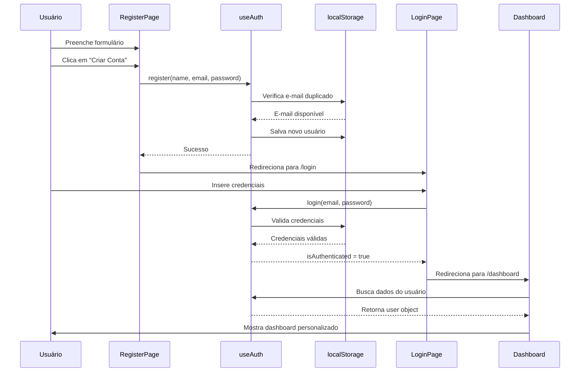
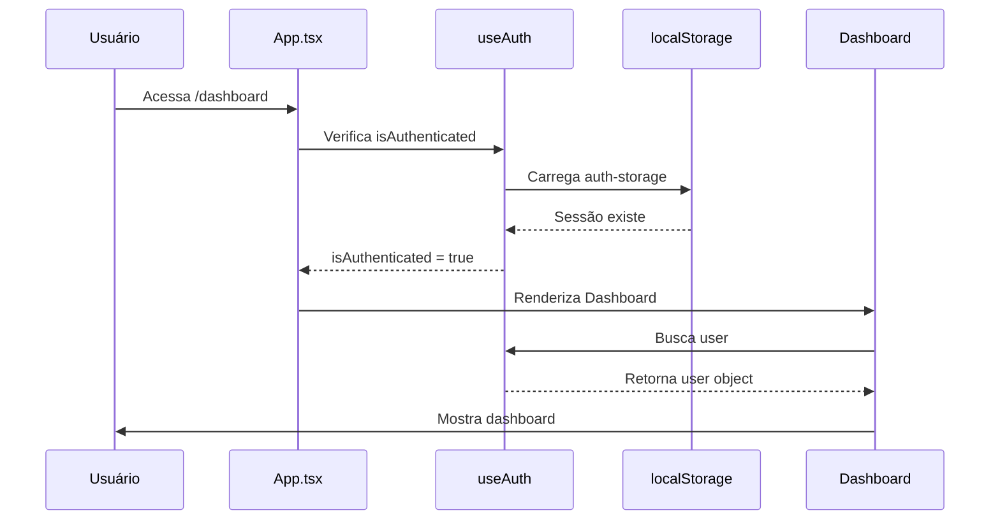
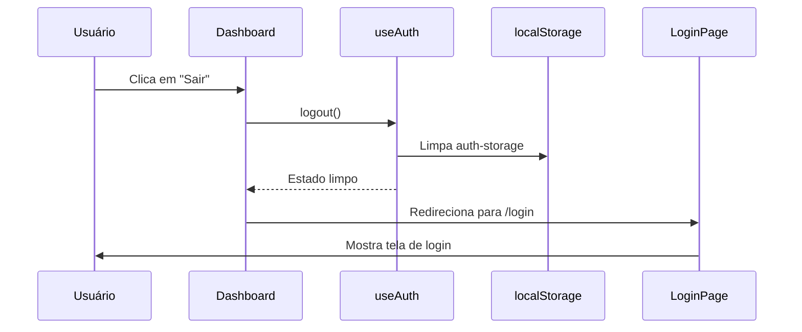

# 🔐 Sistema de Autenticação

## Visão Geral

O sistema de autenticação atual usa **Zustand** com **localStorage** para persistência de sessão. Este é um sistema funcional de desenvolvimento que será substituído pela integração com a API backend.

## Arquitetura

```
┌─────────────────────────────────────────────────────────────┐
│                      Frontend Components                     │
├─────────────────────────────────────────────────────────────┤
│  LoginPage.tsx  │  RegisterPage.tsx  │  DashboardPage.tsx  │
└────────┬────────┴─────────┬──────────┴──────────┬──────────┘
         │                  │                      │
         └──────────────────┼──────────────────────┘
                            │
                            ▼
                   ┌────────────────┐
                   │  useAuth Hook  │
                   │   (Zustand)    │
                   └────────┬───────┘
                            │
         ┌──────────────────┼──────────────────┐
         │                  │                  │
         ▼                  ▼                  ▼
    ┌────────┐       ┌────────────┐     ┌──────────┐
    │ Login  │       │  Register  │     │  Logout  │
    └────────┘       └────────────┘     └──────────┘
         │                  │                  │
         └──────────────────┼──────────────────┘
                            │
                            ▼
                   ┌────────────────┐
                   │  localStorage  │
                   │                │
                   │ • auth-storage │
                   │ • users DB     │
                   └────────────────┘
```

## Hook: `useAuth`

**Localização**: `apps/web/src/hooks/useAuth.ts`

### Estado

```typescript
interface AuthUser {
  id: string;
  name: string;
  email: string;
}

interface AuthState {
  user: AuthUser | null;
  isAuthenticated: boolean;
  register: (name: string, email: string, password: string) => Promise<void>;
  login: (email: string, password: string) => Promise<void>;
  logout: () => void;
}
```

### Funções

#### 1. `register(name, email, password)`

**Fluxo**:
1. Valida se o e-mail já existe
2. Gera ID único (UUID v4)
3. Salva usuário no localStorage
4. **NÃO** faz login automático
5. Usuário deve fazer login manualmente

**Validações**:
- ✅ Nome obrigatório
- ✅ E-mail único
- ✅ Senha (mínimo 12 caracteres)

**Erros**:
- `"E-mail já cadastrado"` → Se o e-mail já existe

**Exemplo**:
```typescript
const { register } = useAuth();

try {
  await register('João Silva', 'joao@email.com', 'senhaForte123!');
  // Sucesso → redireciona para /login
} catch (error) {
  // Mostra erro
}
```

#### 2. `login(email, password)`

**Fluxo**:
1. Busca usuário no localStorage
2. Valida credenciais
3. Define estado `isAuthenticated = true`
4. Armazena dados do usuário

**Validações**:
- ✅ E-mail existe
- ✅ Senha corresponde

**Erros**:
- `"E-mail ou senha incorretos"` → Credenciais inválidas

**Exemplo**:
```typescript
const { login } = useAuth();

try {
  await login('joao@email.com', 'senhaForte123!');
  // Sucesso → redireciona para /dashboard
} catch (error) {
  // Mostra toast de erro
}
```

#### 3. `logout()`

**Fluxo**:
1. Limpa estado de autenticação
2. Remove dados do usuário
3. Mantém usuários cadastrados no localStorage

**Exemplo**:
```typescript
const { logout } = useAuth();

logout(); // Redireciona para /login
```

## Persistência

### localStorage Keys

| Key | Conteúdo | Formato |
|-----|----------|---------|
| `auth-storage` | Estado de autenticação atual | JSON (Zustand persist) |
| `zeroguard-users` | Banco de dados de usuários | JSON Array |

### Estrutura de Dados

**auth-storage**:
```json
{
  "state": {
    "user": {
      "id": "550e8400-e29b-41d4-a716-446655440000",
      "name": "João Silva",
      "email": "joao@email.com"
    },
    "isAuthenticated": true
  },
  "version": 0
}
```

**zeroguard-users**:
```json
[
  {
    "id": "550e8400-e29b-41d4-a716-446655440000",
    "name": "João Silva",
    "email": "joao@email.com",
    "passwordHash": "senhaForte123!",
    "createdAt": "2024-01-15T10:30:00.000Z"
  }
]
```

> ⚠️ **Nota**: As senhas estão em texto plano porque este é um mock. Na integração com o backend, usaremos **Argon2id** para hashing.

## Componentes Integrados

### 1. LoginPage

**Localização**: `apps/web/src/pages/LoginPage.tsx`

**Funcionalidades**:
- Input de e-mail e senha master
- Validação em tempo real
- Mensagens de erro com toast
- Animações com Framer Motion
- Link para página de registro

**Código Principal**:
```typescript
const { login } = useAuth();

const handleLogin = async (e: React.FormEvent) => {
  e.preventDefault();
  
  try {
    setIsLoading(true);
    await login(email, masterPassword);
    
    toast.success('Login realizado com sucesso!');
    navigate('/dashboard');
  } catch (error) {
    toast.error(error instanceof Error ? error.message : 'Erro ao fazer login');
  } finally {
    setIsLoading(false);
  }
};
```

### 2. RegisterPage

**Localização**: `apps/web/src/pages/RegisterPage.tsx`

**Funcionalidades**:
- Input de nome, e-mail, senha e confirmação
- Indicador de força da senha
- Validação de e-mail duplicado
- Animações de entrada
- Link para página de login

**Código Principal**:
```typescript
const { register } = useAuth();

const handleRegister = async (e: React.FormEvent) => {
  e.preventDefault();
  
  if (masterPassword !== confirmPassword) {
    toast.error('As senhas não coincidem');
    return;
  }
  
  try {
    setIsLoading(true);
    await register(name, email, masterPassword);
    
    toast.success('Conta criada com sucesso! Faça login para continuar.');
    navigate('/login');
  } catch (error) {
    toast.error(error instanceof Error ? error.message : 'Erro ao criar conta');
  } finally {
    setIsLoading(false);
  }
};
```

### 3. DashboardPage

**Localização**: `apps/web/src/pages/DashboardPage.tsx`

**Funcionalidades**:
- Exibe nome do usuário no sidebar
- Botão de logout funcional
- Rota protegida (requer autenticação)

**Código Principal**:
```typescript
const { user, logout } = useAuth();
const navigate = useNavigate();

const handleLogout = () => {
  logout();
  toast.success('Logout realizado com sucesso!');
  navigate('/login');
};

// No JSX:
<div className="text-2xl font-bold text-white">
  {user?.name || 'Cofre Digital'}
</div>

<button onClick={handleLogout}>
  <LogOut className="h-5 w-5" />
</button>
```

### 4. App (Rotas Protegidas)

**Localização**: `apps/web/src/App.tsx`

**Funcionalidades**:
- Protege rota `/dashboard`
- Redireciona não autenticados para `/login`

**Código Principal**:
```typescript
const { isAuthenticated } = useAuth();

<Route
  path="/dashboard"
  element={isAuthenticated ? <DashboardPage /> : <Navigate to="/login" />}
/>
```

## Fluxo Completo

### Cenário 1: Novo Usuário



### Cenário 2: Usuário Retornando



### Cenário 3: Logout



## Segurança Atual

### ✅ Implementado

- ✅ Validação de e-mail duplicado
- ✅ Validação de senha (mínimo 12 caracteres)
- ✅ Mensagens de erro genéricas ("E-mail ou senha incorretos")
- ✅ Proteção de rotas (redirect para /login)
- ✅ Sessão persistente entre reloads

### ⚠️ Limitações (Mock)

- ❌ Senhas em texto plano (sem hash)
- ❌ Sem rate limiting
- ❌ Sem proteção contra XSS/CSRF
- ❌ Sem criptografia de dados
- ❌ Sem tokens JWT
- ❌ localStorage não é seguro para produção

## Próximos Passos

### 1. Integração com Backend API

**Objetivo**: Substituir localStorage por chamadas HTTP

**Mudanças**:
```typescript
// Antes (mock):
login: async (email: string, password: string) => {
  const user = findUser(email, password);
  if (!user) throw new Error('E-mail ou senha incorretos');
  set({ user, isAuthenticated: true });
}

// Depois (API):
login: async (email: string, password: string) => {
  const response = await api.post('/auth/login', { email, password });
  const { user, token } = response.data;
  
  // Armazena token JWT
  localStorage.setItem('token', token);
  
  set({ user, isAuthenticated: true });
}
```

### 2. Implementar SRP (Secure Remote Password)

**Objetivo**: Zero-knowledge authentication

**Fluxo**:
1. Cliente deriva chaves localmente com Argon2id
2. Usa `deriveMasterKeys()` do `crypto/core.ts`
3. Implementa protocolo SRP com backend
4. Nunca envia senha em texto plano

### 3. Adicionar JWT Tokens

**Objetivo**: Autenticação stateless

**Implementação**:
- Access token (15 min)
- Refresh token (7 dias)
- Auto-refresh transparente
- Interceptor axios para adicionar token em headers

### 4. Proteção Contra Ataques

**Implementar**:
- Rate limiting (máximo 5 tentativas)
- CAPTCHA após falhas
- HttpOnly cookies para tokens
- CSRF protection
- Content Security Policy

## Testando o Sistema

### Registro de Novo Usuário

1. Acesse http://localhost:3000/register
2. Preencha:
   - **Nome**: João Silva
   - **E-mail**: joao@test.com
   - **Senha**: SenhaForte123!
   - **Confirmar**: SenhaForte123!
3. Clique em "Criar Conta"
4. Veja mensagem de sucesso
5. Será redirecionado para /login

### Login

1. Na página de login, insira:
   - **E-mail**: joao@test.com
   - **Senha**: SenhaForte123!
2. Clique em "Entrar"
3. Veja o dashboard com seu nome no sidebar

### Logout

1. No dashboard, clique no ícone de logout (canto superior direito)
2. Veja mensagem de sucesso
3. Será redirecionado para /login

### Testando Erros

**E-mail duplicado**:
```
1. Registre: joao@test.com
2. Tente registrar novamente: joao@test.com
3. Veja erro: "E-mail já cadastrado"
```

**Credenciais inválidas**:
```
1. Tente login com: teste@inexistente.com
2. Veja erro: "E-mail ou senha incorretos"
```

**Sessão persistente**:
```
1. Faça login
2. Recarregue a página (F5)
3. Continue autenticado
```

## Debugging

### Ver Estado no Console

```javascript
// No console do navegador:
JSON.parse(localStorage.getItem('auth-storage'))
JSON.parse(localStorage.getItem('zeroguard-users'))
```

### Limpar Todos os Dados

```javascript
localStorage.clear()
// Depois recarregue a página
```

### Ver Usuários Cadastrados

```javascript
const users = JSON.parse(localStorage.getItem('zeroguard-users') || '[]');
console.table(users);
```

## Estrutura de Arquivos

```
apps/web/src/
├── hooks/
│   └── useAuth.ts              # ⭐ Hook principal de autenticação
├── pages/
│   ├── LoginPage.tsx           # 🔐 Página de login
│   ├── RegisterPage.tsx        # ✍️ Página de registro
│   └── DashboardPage.tsx       # 🏠 Dashboard (protegida)
└── App.tsx                     # 🛣️ Rotas protegidas
```

## FAQ

### Como funciona a persistência?

Zustand usa o middleware `persist` que automaticamente salva o estado no localStorage sempre que há mudanças. Ao recarregar a página, o estado é restaurado.

### Por que não fazer login automático após registro?

Para evitar confusão na UX e manter o fluxo claro: registro → confirmação → login manual.

### Posso usar esse código em produção?

**NÃO**. Este é um mock de desenvolvimento. Para produção, você precisa:
- API backend com banco de dados real
- Hashing de senha com Argon2id
- Tokens JWT
- HTTPS obrigatório
- Rate limiting e proteções

### Como adicionar mais campos ao usuário?

1. Edite a interface `AuthUser` em `useAuth.ts`
2. Adicione campos ao formulário de registro
3. Salve no localStorage (ou envie para API)

### Como resetar senha?

Atualmente não implementado. Para adicionar:
1. Criar página `/forgot-password`
2. Adicionar função `resetPassword()` ao useAuth
3. Enviar e-mail (simulado ou real via API)
